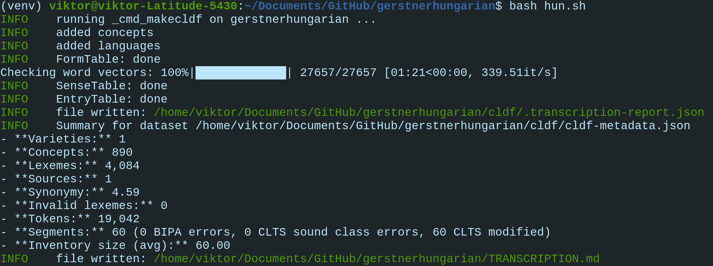

Part 1: Create CLDF
===================

The following six steps will guide you through the process of
converting raw language data to CLDF. Each step can be found in the
`continuous integration workflow
<https://app.circleci.com/pipelines/github/LoanpyDataHub/gerstnerhungarian>`_
as well. The data we are converting comes from
the `New Hungarian Etymological Dictionary
<https://uesz.nytud.hu/index.html>`_ (Gerstner 2022),
which contains modern `Hungarian
<https://glottolog.org/resource/languoid/id/hung1274>`_ words as headwords,
together with their
etymological source language and year of first appearance in a written source.
The oldest layer is inherited from Proto-Uralic, followed chronologically by
Proto-Finno-Ugric and
Proto-Ugric. The next oldest layer is borrowed from a Turkic language called
West Old Turkic, or `Proto-Bolgar
<https://glottolog.org/resource/languoid/id/bolg1249>`_. The raw data in this
repository contains
only a small fraction of the contents of the dictionary.
If you are passionate about Hungarian etymologies and want to contribute
to this repository, check out the `guidelines
<https://github.com/martino-vic/gerstnerhungarian/blob/main/CONTRIBUTING.md>`_
and let's get in touch!

Step 1: Activate virtual environment and clone the repository
-------------------------------------------------------------

.. code-block:: sh

   python3 -m venv venv && source venv/bin/activate
   git clone https://github.com/martino-vic/gerstnerhungarian.git

To deactivate the virtual environment run

.. code-block:: sh

   deactivate

All steps in this documentation should be carried out in a virtual
environment. Originally, the skeleton of the repository was created using this
command:

.. code-block:: sh

   cldfbench new

More on this can be read in the
`cldfbench tutorial <https://github.com/cldf/cldfbench/blob/master/doc/tutorial.md>`_.
Next, open the file ``metadata.json`` and manually add the line
``"conceptlist": "Dellert-2018-1016"`` to it. This will give access to the
concept list used by the `NorthEuraLex <http://www.northeuralex.org/>`_
project. There, this concept list was used for comparison of Uralic languages,
Hungarian among others, and was therefore deemed adequate
to filter the raw input data of this repository according to it.

Step 2: Clone reference catalogues and loanpy
---------------------------------------------

- `Glottolog <https://glottolog.org/>`_ (Hammarström et al. 2022)
  to reference the languages in the repo.
- `Concepticon <https://concepticon.clld.org/>`_ (List et al. 2023) for
  referencing concepts.
- `LoanPy <https://loanpy.readthedocs.io/en/latest/?badge=latest>`_
  (Martinović 2023). This step will not be necessary once version 3 is out.

.. warning::

   The following repositories will take over 1GB in disk-space. If you skip
   cloning them,
   add a ``--dev`` flag to the command running the lexibank script in step 5.

.. code-block:: sh

   mkdir concepticon
   cd concepticon
   git clone https://github.com/concepticon/concepticon-data.git
   cd ..
   git clone https://github.com/glottolog/glottolog.git
   git clone https://github.com/cldf-clts/clts.git
   git clone https://github.com/martino-vic/loanpy.git

Step 3: Install commands, download wordvectors, create orthographic profile
---------------------------------------------------------------------------

The ``-e`` flag will install all necessary dependencies in development mode.
I.e. if you modify any code in those repositories, changes will apply
immediately.

.. code-block:: sh

   pip install -e gerstnerhungarian
   pip install -e loanpy

Installing these two packages will also install all their dependencies,
which are specified in their respective ``setup.py`` files. One of the
dependencies that has been installed together with *gerstnerhungarian* is
`Spacy <https://pypi.org/project/spacy/>`_. Spacy offers pre-trained
wordvector models for German. Since NLP is a rapidly changing field, it is
adviced
to always download the most up-to-date vectors from the most up-to-date
packages. The architecture allows you to replace Spacy with any library
or function of choice. We will be using a 500MB model for the current
use case. If this should be too large, you can browse smaller German models at
https://spacy.io/models/de/. To download the 500MB file run:

.. code-block:: sh

   python3 -m spacy download de_core_news_lg

After downloading the word-vectors to your system, let's create the
orthographic profiles: The process of creating an orthographic profile for
Hungarian was described in step 4 of the documentation of the
`ronataswestoldturkic
<https://ronataswestoldturkic.readthedocs.io/en/latest/mkcldf.html>`__
repository. Since the current repository only covers one language, there is no
need for a folder ``orthography`` with multiple profiles. A single file named
``orthography.tsv`` is enough. The file itself was taken from
``ronataswestoldturkic/etc/orthography/H.tsv``.

Step 4: Run lexibank script
---------------------------

This script combines files from the ``raw`` and ``etc`` folders
and populates the folder `cldf`.

.. code-block:: sh

   cldfbench lexibank.makecldf lexibank_ronataswestoldturkic.py  --concepticon-version=v2.5.0 --glottolog-version=v4.5 --clts-version=v2.2.0 --concepticon=../concepticon/concepticon-data --glottolog=../glottolog --clts=../clts
   cldfbench gerstnerhungarian.update_readme

The first line of this shell script invokes `cldfbench
<https://pure.mpg.de/rest/items/item_3259068/component/file_3261838/content>`_,
a workbench for creating and managing CLDF datasets. The first three
flags ("dash dash") specify the versions of the reference catalogues. This is
important,
since wrong versions can lead to mismatches in the references and may
obstruct the CLDF-conversion.
The last three flags specify the location of the reference
catalogues. Those flags were added with increased replicability and
maintainability in mind (Even though there is an alternative, namely editing
the *catalog.ini* file with a text editor like *nano*, as showed in
`this blog post <https://calc.hypotheses.org/2225>`_).
The second line is a custom command that updates the readme by adding some
custom badges and statistics.

Below is a detailed description of what the lexibank script does.
See also the tutorial at https://calc.hypotheses.org/3318, which has many
similarities.

.. code-block:: python

   import pathlib
   import re
   from collections import defaultdict
   from functools import lru_cache

First, we import four inbuilt Python-libraries.

- The `pathlib <https://docs.python.org/3/library/pathlib.html>`_ library
  will be used to define the parent directory of the dataset, relative to
  which all other files will be read and written.
- The regular expression library `re
  <https://docs.python.org/3/library/re.html>`_
  will be used for data cleaning with the `re.sub
  <https://docs.python.org/3/library/re.html#re.sub>`_ function and for
  splitting strings with `re.split
  <https://docs.python.org/3/library/re.html#re.Pattern.split>`_.
- `defaultdict <https://docs.python.org/3/library/collections.html#collections.defaultdict>`_
  defines a data type to which missing dictionary keys automatically default.
- The `lru_cache <https://docs.python.org/3/library/functools.html#functools.lru_cache>`_
  will help to speed up looking up word-vectors, since the same words are being
  looked up often.

.. code-block:: python

   import attr
   import pylexibank
   import spacy
   from cldfbench import CLDFSpec
   from clldutils.misc import slug
   from epitran import Epitran
   from lingpy.sequence.sound_classes import ipa2tokens
   from loanpy.scapplier import Adrc
   from pylexibank import Dataset as BaseDataset, FormSpec, Lexeme
   from tqdm import tqdm

Then, we import functionalities from various third-party libraries.
These were installed when running ``pip install -e gerstnerhungarian``
eariler.

- With the `attrs <https://www.attrs.org/en/stable/index.html>`_ library
  we will create the custom language class with custom columns in the output
  file ``cldf/forms.csv``.
- `Spacy <https://pypi.org/project/spacy/>`_ will be used to check the word
  vector coverage of the meanings associated with each headword.
- The `slug <https://clldutils.readthedocs.io/en/latest/misc.html#clldutils.misc.slug>`_
  function from the clldutils library will be used to format some IDs.
- The `epitran <https://pypi.org/project/epitran/>`_ library will be used to
  transcribe words from Hungarian orthography to IPA.
- The `ipa2tokens
  <https://lingpy.readthedocs.io/en/latest/reference/lingpy.sequence.html#lingpy.sequence.sound_classes.ipa2tokens>`_
  function from the lingpy library will be used to tokenise ipa-strings.
- The `Adrc
  <https://loanpy.readthedocs.io/en/latest/documentation.html#loanpy.scapplier.Adrc>`_
  class from loanpy will be used to predict historical
  reconstructions based on sound changes that were extracted in the
  `ronataswestoldturkic
  <https://ronataswestoldturkic.readthedocs.io/en/latest/home.html>`__
  repository.
- The classes from the `pylexibank <https://pypi.org/project/pylexibank/>`_
  library are all related to specifying the output format. ``Dataset`` for
  example
  loads the default data format, ``Lexeme`` will be used to customise it, and
  ``FormSpec`` will be used to document the cleaning of the raw data.

.. code-block:: python

   HOWMANY = 700
   TRIMLIST = ["dozik$", "kodik$", "kedik$", "kozik$", "ködik$",
               "odik$", "ődik$", "ozik$", "edik$", "ödik$", "ázik$", "ezik$",
               "edik$", "ödik$", "ődik$", "ozik$", "ik$"]

Here, we are defining two static parameters. One is the number of predictions
we want to make per Hungarian word. The optimum was calculated in `Step 5
<https://ronataswestoldturkic.readthedocs.io/en/latest/mkloanpy.html#step-5-evaluate-vertical-and-horizontal-sound-correspondences>`__
and visualised in `Step 6 <https://ronataswestoldturkic.readthedocs.io/en/latest/mkloanpy.html#step-6-plot-the-evaluations>`__
of the ronataswestoldturkic repository. The other is a list of regular
expressions that will later be used to remove suffixes in Hungarian verbs that
have a different etymology than the rest of the verb they belong to.

.. code-block:: python

   REP = [(x, "") for x in "†×∆-¹²³⁴’"]
   nlp = spacy.load('de_core_news_lg')
   rc = Adrc("etc/H2EAHsc.json")
   orth2ipa = Epitran("hun-Latn").transliterate

In this block we are defining some global variables that we will need later.
The variable REP stands for 'replacements' and will be used to create
the column "forms" from the column "values", where replacements are hard-coded.
There is only one simple replacement rule, which is expressed as a list
comprehension, namely that characters "†×∆-¹²³⁴’" are deleted in each
word.

Next, we are loading the word-vectors that we have downloaded in step 3.
``rc`` is an instance of
loanpy's Adrc class and "etc/H2EAHsc.json" is the sound correspondence file
we have generated in `Part 3, step 3 of the ronataswestoldturkic
repository
<https://ronataswestoldturkic.readthedocs.io/en/latest/mkloanpy.html#step-3-mine-vertical-and-horizontal-sound-correspondences>`_.
The file itself has been directly copied from
``ronataswestoldturkic/loanpy/H2EAHsc.json``. This is the information based
on which we will reconstruct hypothetical Early Ancient Hungarian forms.
Lastly, ``orth2ipa`` is a function that transcribes strings in Hungarian
orthography to IPA with the help of the `epitran
<https://pypi.org/project/epitran/>`_ package.

.. code-block:: python

   @attr.s
   class CustomLexeme(Lexeme):
       Meaning = attr.ib(default=None)
       Sense_ID = attr.ib(default=None)
       Entry_ID = attr.ib(default=None)

Here we are defining three custom columns that are not included by default,
using `attr.ib <https://www.attrs.org/en/stable/api-attr.html#attr.ib>`_
and the Lexeme class that we have imported earlier.
The column ``Meaning`` comes directly from the raw file and contains a ", "
separated list of translations into English that we will call "senses".
Sense_ID is a foreign key that points to one of the senses in the
``senses.csv`` table and ``Entry_ID`` is a foreign key that points to the
corresponding row in ``entries.csv``.

.. code-block:: python

   def clean1(word):
       return re.sub("[†×∆\-¹²³⁴’ ]", "", word)

   def clean(text):
       text = re.sub(r'[〈〉:;!,.?-]', '', text)
       text = re.sub(r'\s+', ' ', text)
       text = text.strip()
       return text

These two functions will be used later in the script to remove some
characters from strings with the help of the `re
<https://docs.python.org/3/library/re.html>`_ library.

.. code-block:: python

   def seg_ipa(word):
       word = clean1(word)
       word = orth2ipa(word)
       word = ipa2tokens(word, merge_vowels=False, merge_geminates=False)
       word.append("-")
       return " ".join(word)

This function will be used to populate the column ``Segments`` in
``cldf/entries.csv``. It cleans, ipa-transcribes, and segments
an input string and returns it as a space-separated string.

.. code-block:: python

   def trim(word):
       if word in ["antik", "bolsevik"]:
           return word
       return re.sub("|".join(TRIMLIST), "", clean1(word))

This function uses the static list of suffixes defined earlier and cuts
them off an input string.

.. code-block:: python

   @lru_cache(maxsize=None)
   def filter_vectors(meaning):
       clean_mean = clean(meaning)
       return clean_mean if nlp(clean_mean).has_vector else None

This function will be used when populating the column ``Spacy`` in
``cldf/senses.csv``. It takes a string as input, which can be a word
or a phrase. It then checks whether spacy's word-vector model contains a
vector for the cleaned input. If yes, it returns the cleaned input, if not
it returns None, which translates to a blank row in our column.

.. code-block:: python

   class Dataset(BaseDataset):
       dir = pathlib.Path(__file__).parent
       id = "gerstnerhungarian"

       form_spec = FormSpec(separators=",", first_form_only=True,
                            replacements=REP)
       lexeme_class = CustomLexeme

Here we define a class and inherit the default format ``BaseDataset`` that we
have imported in the beginning. ``dir`` is the working directory and is
defined with the help of ``pathlib`` that we have imported in the beginning.
``id`` is the name of the repository. In ``lexeme_class`` we are plugging in
the custom columns that we have created earlier. In ``form_spec`` we are
plugging in the data-cleaning rules that were read into the ``REP`` variable
earlier, using the ``FormSpec`` class we have imported in the beginning.

.. code-block:: python

	def cmd_makecldf(self, args):

This function is being run when summoning the lexibank script from the command
line. It converts the data from folders ``raw`` and ``etc`` to standardised
CLDF data.

.. code-block:: python

   senses = defaultdict(list)
   idxs = {}
   form2idx = {}
   for idx, row in enumerate(self.raw_dir.read_csv(
       "Gerstner-2016-10176.tsv", delimiter="\t", dicts=True)):
       if row["sense"].strip():
           fidx = str(idx+1)+"-"+slug(row["form"])
           idxs[fidx] = row
           for sense in re.split("[,;]", row["sense"]):
               if row["form"].strip() and sense.strip():
                   senses[slug(sense, lowercase=False)] += [(fidx, sense)]
                   form2idx[row["form"], sense.strip()] = fidx

Here we are populating three dictionaries for later use: ``senses``
``idxs`` and ``form2idx``. The first will be used to create the table
``senses.csv``, the second to create ``cldf/entries.csv`` and the third
to create the foreign keys in column ``Entry_ID`` in ``cldf/forms.csv``.

.. code-block:: python

   with self.cldf_writer(args) as writer:
       writer.add_sources()
       concepts = {}
       for concept in self.conceptlists[0].concepts.values():
           idx = "{0}-{1}".format(concept.number, slug(concept.gloss))
           writer.add_concept(
                   ID=idx,
                   Name=concept.gloss,
                   Concepticon_ID=concept.concepticon_id,
                   Concepticon_Gloss=concept.concepticon_gloss,
                   )
           concepts[concept.concepticon_id] = idx
       args.log.info("added concepts")

Here we are writing the table ``cldf/parameters.csv``, which contains
additional information about meanings and links them to reference catalogues.
It is based on a concept list that we have specified in the metadata.json
file, when setting up the repository earlier.

.. code-block:: python

   for language in self.languages:
       writer.add_language(
               ID="Hungarian",
               Name="Hungarian",
               Glottocode="hung1274"
               )
   args.log.info("added languages")

In this section, we are creating the file ``cldf/language.csv`` by adding
language
IDs. Since this repository consists of only one language, it can be hard-coded
as "Hungarian", together with its code in the `Glottolog
<https://glottolog.org/>`_ reference catalogue.

.. code-block:: python

   language_table = writer.cldf["LanguageTable"]

   for row in self.raw_dir.read_csv(
       "wordlist.tsv", delimiter="\t", dicts=True):
       try:
           writer.add_forms_from_value(
               Local_ID=row["ID"],
               Language_ID="Hungarian",
               Parameter_ID=concepts[row["CONCEPTICON_ID"]],
               Value=row["FORM"],
               Meaning=row["MEANING"],
               Entry_ID=form2idx[row["FORM"], row["SENSE"].strip()],
               Sense_ID=row["SENSE_ID"],
               Source="uesz"
               )
       except KeyError:
           pass

    args.log.info("FormTable: done")

Here we are creating the file ``cldf/forms.csv``, which is created by looping
through the rows of ``raw/wordlist.tsv``. This file in turn is a filtered
version of ``raw/Gerstner-2016-10176.tsv``. The filtering process will be
explained in Part 2. The columns ``Local_ID`` ``Value`` ``Meaning``
and ``Sense_ID`` are directly filled from the raw file, while the columns
``Parameter_ID`` (foreign keys to ``cldf/parameters.csv``) and ``Entry_ID``
(foreign keys to ``cldf/entries.csv``) are filled by accessing the information
stored in the dictionaries ``concepts`` and ``form2idx`` that we have created
a little earlier. The values in columns ``Language_ID`` and ``Source`` are
always the same and can therefore be hard-coded.

.. code-block:: python

    with self.cldf_writer(args, cldf_spec="dictionary",
            clean=False) as writer:

        writer.cldf.add_component(language_table)

        writer.cldf.add_columns(
            "EntryTable",
            {"name": "Segments", "datatype": "string"},
            {"name": "Year", "datatype": "integer"},
            {"name": "Etymology", "datatype": "string"},
            {"name": "Loan", "datatype": "string"},
            {"name": "f"rc{HOWMANY}"", "datatype": "string"}
        )

        writer.cldf.add_columns(
            "SenseTable",
            {"name": "Spacy", "datatype": "string"}
        )

Here we are summoning two types of tables: `EntryTable
<https://github.com/cldf/cldf/tree/master/components/entries>`_ and
`SenseTable <https://github.com/cldf/cldf/tree/master/components/senses>`_.
A list
of possible table types to choose from is listed in `CLDF's GitHub reposiotry
<https://github.com/cldf/cldf/tree/master/components>`_. We are adding
some extra columns to the default settings, which are needed for our specific
use-case. Namely columns ``Segments``, ``Year``, ``Etymology``, ``Loan``, and
``f"rc{HOWMANY}"`` to ``EntryTable`` and ``Spacy`` to ``SenseTable``.
The purpose of these columns will be clarified in the next paragraphs.

.. code-block:: python

   senses_items = senses.items()
   args.log.info("Checking word vectors")
   for j, (sense, values) in enumerate(
           tqdm(senses_items, "Checking word vectors")):
       for i, (fidx, sense_desc) in enumerate(values):
           vector = filter_vectors(sense_desc)
           writer.objects["SenseTable"].append({
               "ID": sense + "-" + str(i + 1),
               "Entry_ID": fidx,
               "Description": sense_desc.strip(),
               "Spacy": vector
               })
       if j % 6000 == 0:
           msg = f"{j+1}/{len(senses_items)} word vectors checked"
           args.log.info(msg)

   args.log.info("SenseTable: done")

Here we are creating the file ``cldf/senses.csv`` by looping through the
``senses`` object that we have created earlier. Each row of the column
``sense`` in the file ``raw/Gerstner-2016-10176.tsv`` contains multiple
translations to English, separated by ", ". Since it is best practice to
avoid complex data structures like lists in databases, each translation
will get its own row and a foreign key in the file ``cldf/senses.csv``.
Since the raw file contains roughly 10,000 rows and there are on average ca. 4
translations per entry, we end up with a ``cldf/senses.csv`` table of ca.
40,000 rows.
Apart from the default columns ``ID`` (the primary key), ``Entry_ID``
(foreign keys pointing to ``cldf/entries.csv``) and ``Discription``
(containing the single translations), there is one custom column that we
have added, namely ``Spacy``. Here we are removing unwanted characters and
checking whether the translation has a word-vector representation in the
`Spacy <https://pypi.org/project/spacy/>`_ vector model that we have
downloaded in step 3 and loaded in the beginning of this script. This is
being done with the ``filter_vectors`` function that we have described
earlier in this section.

.. code-block:: python

   for fidx, row in idxs.items():
       seg_ipa = tokens2clusters(ipa2tokens(orth2ipa(clean1(row["form"]))))
       writer.objects["EntryTable"].append({
           "ID": fidx,
           "Language_ID": "Hungarian",
           "Headword": row["form"],
           "Segments": seg_ipa,
           "Year": row["year"],
           "Etymology": row["origin"],
           "Loan": row["Loan"],
           f"rc{HOWMANY}": rc.reconstruct(seg_ipa, 100)
           })

In this final step we are creating the table ``cldf/entries.csv``, which
will serve as input for the loanword searching module of the loanpy library
later on. This
table contains the same amount of rows as ``raw/Gerstner-2016-10176.tsv``, so
it is unfiltered. The columns ``Headword`` ``Year`` ``Etymology`` and ``Loan``
are directly taken from the raw file. The primary key ``ID`` was
defined in the beginning of the ``cmd_makecldf`` method and was stored in the
``idxs`` object, through which we are looping at the moment. ``Language_ID``
is the only foreign key, pointing to the one language in
``cldf/languages.csv``. There are two columns that will contain processed
information. One is ``Segments``: These are IPA transcriptions from cleaned
data, tokenised and segmented. This
step has to be done using the `epitran <https://pypi.org/project/epitran/>`_
library, since pylexibank's automatic orthographic transcription can only be
used in ``cldf/forms.csv``, which in our case contains only filtered data.
The second, and most important column for further analysis is ``f"rc{HOWMANY}"``.
``rc`` stands for "reconstruct" and HOWMANY for the number of guesses or false
positives per attempted reconstruction that we have defined in the beginning.
The reconstruction itself is a regular
expression, created by the `loanpy.scapplier.Adrc.reconstruct
<https://loanpy.readthedocs.io/en/latest/documentation.html#loanpy.scapplier.Adrc.reconstruct>`_.

This is how your console should approximately look like after the conversion:

          INFO    running _cmd_makecldf on gerstnerhungarian ...
          INFO    added concepts
          INFO    added languages
          INFO    FormTable: done
          INFO    Checking word vectors
          INFO    1/27657 word vectors checked
          INFO    6001/27657 word vectors checked
          INFO    12001/27657 word vectors checked
          INFO    18001/27657 word vectors checked
          INFO    24001/27657 word vectors checked
          INFO    SenseTable: done
          INFO    file written: /home/viktor/Documents/GitHub/gerstnerhungarian/cldf/.transcription-report.json
          INFO    Summary for dataset /home/viktor/Documents/GitHub/gerstnerhungarian/cldf/cldf-metadata.json
          - **Varieties:** 1
          - **Concepts:** 890
          - **Lexemes:** 4,084
          - **Sources:** 1
          - **Synonymy:** 4.59
          - **Invalid lexemes:** 0
          - **Tokens:** 19,042
          - **Segments:** 60 (0 BIPA errors, 0 CLTS sound class errors, 60 CLTS modified)
          - **Inventory size (avg):** 60.00
          INFO    file written: /home/viktor/Documents/GitHub/gerstnerhungarian/TRANSCRIPTION.md
          INFO    file written: /home/viktor/Documents/GitHub/gerstnerhungarian/cldf/lingpy-rcParams.json
          INFO    ... done gerstnerhungarian [90.6 secs]

Step 5: Update readme
---------------------

.. code-block:: sh

   cldfbench gerstnerhungarian.update_readme

Here's what happens under the hood:

.. automodule:: gerstnerhungariancommands.update_readme
   :members:

Step 6: Test with pytest-cldf whether the dataset is CLDF-conform
-----------------------------------------------------------------

.. code-block:: sh

   pip install pytest-cldf
   pytest --cldf-metadata=cldf/cldf-metadata.json test.py

This runs one test with pytest that verifies that the data in the folder
``cldf`` confirms to the CLDF-standard. If it says "1 passed" on your console
the conversion was successful and you can click on the ``Next`` button
to see how to filter the converted data.
